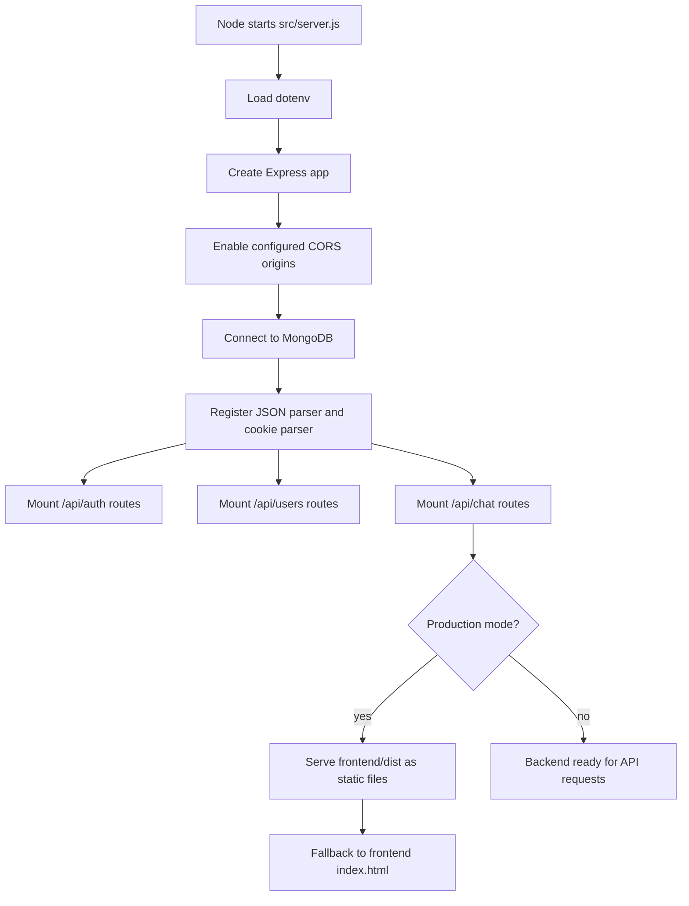

# Backend Flow Control And API Map

This document explains how the backend starts, how requests move through middleware and controllers, which REST APIs are exposed, and where the core business logic lives.

## 1. Startup Flow

### What happens at boot

1. `src/server.js` loads environment variables and creates the Express app.
2. CORS is restricted to `http://localhost:5173` and cookies are allowed.
3. `connectDB()` runs before the server starts listening.
4. JSON request bodies and cookies are parsed globally.
5. Route groups are mounted under `/api/auth`, `/api/users`, and `/api/chat`.
6. In production, the backend also serves the built frontend from `frontend/dist`.

## 2. Request Flow Control

Most protected requests follow the same path:

1. Client sends request with the `jwt` cookie.
2. `protectRoute` reads the cookie.
3. `jsonwebtoken.verify()` validates the token.
4. The user is fetched from MongoDB and attached to `req.user`.
5. The route handler runs with the authenticated user context.

That means the middleware is the main traffic gate for any route that needs a logged-in user.

## 3. REST API Surface

### Auth APIs

| Method | Path                   | Protection | Purpose                                                                                                     |
| ------ | ---------------------- | ---------- | ----------------------------------------------------------------------------------------------------------- |
| POST   | `/api/auth/signup`     | Public     | Create a new user, hash password through the model hook, create a JWT cookie, and upsert the user to Stream |
| POST   | `/api/auth/login`      | Public     | Verify email/password, set JWT cookie, return user data                                                     |
| POST   | `/api/auth/logout`     | Public     | Clear the JWT cookie                                                                                        |
| POST   | `/api/auth/onboarding` | Protected  | Save onboarding profile fields and mark user as onboarded                                                   |
| GET    | `/api/auth/me`         | Protected  | Return the authenticated user                                                                               |

### User and Friends APIs

| Method | Path                                   | Protection | Purpose                                                                  |
| ------ | -------------------------------------- | ---------- | ------------------------------------------------------------------------ |
| GET    | `/api/users/`                          | Protected  | Return recommended users                                                 |
| GET    | `/api/users/friends`                   | Protected  | Return my friends list with populated profile fields                     |
| POST   | `/api/users/friend-request/:id`        | Protected  | Send a friend request to another user                                    |
| PUT    | `/api/users/friend-request/:id/accept` | Protected  | Accept a friend request and add both users to each other’s friends lists |
| DELETE | `/api/users/friend-request/:id`        | Protected  | Delete a pending friend request                                          |
| GET    | `/api/users/friend-requests`           | Protected  | Fetch incoming pending and accepted requests                             |
| GET    | `/api/users/outgoing-friend-requests`  | Protected  | Fetch outgoing pending requests                                          |

### Chat API

| Method | Path              | Protection | Purpose                                                      |
| ------ | ----------------- | ---------- | ------------------------------------------------------------ |
| GET    | `/api/chat/token` | Protected  | Generate and return a Stream Chat token for the current user |

## 4. Backend Logic Areas

### Authentication Logic

The auth controller handles signup, login, logout, and onboarding.

- `signup` validates required fields, checks password length, validates email format, and prevents duplicate emails.
- A random profile avatar is assigned at signup.
- Password hashing is handled by the `User` model pre-save hook with `bcryptjs`.
- A JWT is signed with `JWT_SECRET_KEY` and stored in an `httpOnly` cookie.
- `login` reuses the same JWT cookie flow after password verification.
- `logout` clears the `jwt` cookie.
- `onboard` updates profile details and flips `isOnboarded` to `true`.

### Friend System Logic

The user controller manages discovery, friend requests, and friend lists.

- `getRecommendedUsers` excludes the current user, existing friends, and anyone not onboarded.
- `getMyFriends` loads the current user and populates the `friends` array with public profile fields.
- `sendFriendRequest` blocks self-requests, blocks requests to users already in the friend list, and prevents duplicate request pairs.
- `acceptFriendRequest` verifies the recipient owns the request, marks the request as accepted, and adds both users to each other’s `friends` arrays.
- `deleteFriendRequest` removes a pending request for the recipient.
- `getFriendRequests` returns incoming pending and accepted requests.
- `getOutgoingFriendRequests` returns pending requests sent by the current user.

### Chat Token Logic

The chat controller generates a Stream Chat token for the authenticated user. The Stream client is created in `src/lib/stream.js`, and users are upserted into Stream during signup and onboarding.

### Data Model Logic

`User` stores identity, profile fields, onboarding state, and friend references.

- Password hashing happens in the model, not the controller.
- `matchPassword()` compares the entered password against the stored hash.

`FriendRequest` stores sender, recipient, and status.

- Status values are currently `pending` and `accepted`.
- The schema is timestamped, so request history can be tracked.

### Infrastructure Logic

- `src/lib/db.js` connects to MongoDB and terminates the process if the connection fails.
- `src/lib/stream.js` centralizes Stream Chat user upsert and token generation.

## 5. Important Runtime Notes

These are the main implementation mismatches to be aware of when running the backend:

- `src/lib/db.js` reads `MONGODB_URI` and supports `MONGO_URI` as a compatibility fallback.
- `src/lib/stream.js` reads `process.env.STREAM_API_KEY` and `process.env.STREAM_API_SECRET`, matching `.env.example`.
- The frontend build reads `VITE_STREAM_API_KEY`; this public Stream API key must be available during the frontend build.

If those env names are not aligned in the real `.env` file, MongoDB or Stream Chat initialization will fail at runtime.

## 6. Short Summary

The backend is a JWT-cookie based Express API with three main areas:

1. Authentication and onboarding.
2. Social graph and friend requests.
3. Stream Chat token generation.

The main flow control is centralized in `protectRoute`, and the controller layer contains the actual business rules for signup, onboarding, friend management, and chat token creation.
